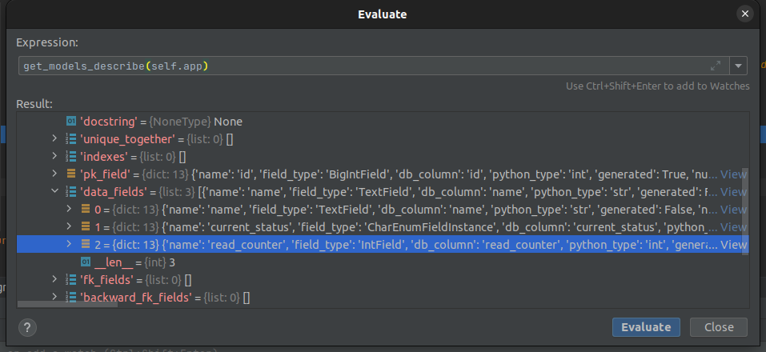

# Problems with Tortoise/aerich

The aerich does not upgrade the database for some reason:

```
(venv) ➜  sqlAlchemyExporiment git:(master) sqlite3 main.sqlite3

SQLite version 3.37.0 2021-12-09 01:34:53
Enter ".help" for usage hints.
sqlite> PRAGMA table_info(items);
0|id|INTEGER|1||1
1|name|TEXT|1||0
2|current_status|VARCHAR(3)|1||0
sqlite> ^D

(venv) ➜  sqlAlchemyExporiment git:(master) aerich upgrade

Success upgrade 1_20220923163900_update.py

(venv) ➜  sqlAlchemyExporiment git:(master) sqlite3 main.sqlite3

SQLite version 3.37.0 2021-12-09 01:34:53
Enter ".help" for usage hints.
sqlite> PRAGMA table_info(items);
0|id|INTEGER|1||1
1|name|TEXT|1||0
2|current_status|VARCHAR(3)|1||0

sqlite> SELECT * FROM aerich;

1|0_20220923150936_init.py|models|{"models.Item": {"name": "models.Item", "app": "models", "table": "items", //
3|1_20220923163900_update.py|models|{"models.Item": {"name": "models.Item", "app": "models", "table": "items", //
```

Migrations seem to be applied, but not reflected in the actual database state.

It seems that the additional field got discovered correctly in aerich migration code.



Looks like aerich returned only the code of the migration in this place instead of performing the actual migration:

```python

diff --git a/aerich/__init__.py b/aerich/__init__.py
index 67ef7e3..c992a3a 100644
--- a/aerich/__init__.py
+++ b/aerich/__init__.py
@@ -50,7 +50,8 @@ class Command:
                     file_path = Path(Migrate.migrate_location, version_file)
                     m = import_py_file(file_path)
                     upgrade = getattr(m, "upgrade")
-                    await upgrade(conn)
+                    result = await upgrade(conn)
+                    print(result)
                     await Aerich.create(
                         version=version_file,
                         app=self.app,
(END)


```

The result is:

```
/home/gonczor/.cache/pypoetry/virtualenvs/aerich-SqlUO1o8-py3.9/bin/python /home/gonczor/Projects/aerich/aerich/cli.py upgrade 
['ALTER TABLE "items" ADD "read_counter" INT NOT NULL  DEFAULT 0']
Success upgrade 1_20220923163900_update.py
```

This `upgrade` gets the function:

```python
async def upgrade(db: BaseDBAsyncClient) -> List[str]:
    return [
        """ALTER TABLE "items" ADD "read_counter" INT NOT NULL  DEFAULT 0"""
    ]
```


After adding some code that actually runs those queries it seems that the issue is solved:

```python

diff --git a/aerich/__init__.py b/aerich/__init__.py
index 67ef7e3..8c0c169 100644
--- a/aerich/__init__.py
+++ b/aerich/__init__.py
@@ -2,7 +2,7 @@ import os
 from pathlib import Path
 from typing import List
 
-from tortoise import Tortoise, generate_schema_for_client
+from tortoise import Tortoise, generate_schema_for_client, BaseDBAsyncClient
 from tortoise.exceptions import OperationalError
 from tortoise.transactions import in_transaction
 from tortoise.utils import get_schema_sql
@@ -50,7 +50,8 @@ class Command:
                     file_path = Path(Migrate.migrate_location, version_file)
                     m = import_py_file(file_path)
                     upgrade = getattr(m, "upgrade")
-                    await upgrade(conn)
+                    queries = await upgrade(conn)
+                    await self._perform_raw_queries(conn, queries)
                     await Aerich.create(
                         version=version_file,
                         app=self.app,
@@ -83,13 +84,18 @@ class Command:
                 downgrade = getattr(m, "downgrade", None)
                 if not downgrade:
                     raise DowngradeError("No downgrade items found")
-                await downgrade(conn)
+                queries = await downgrade(conn)
+                await self._perform_raw_queries(conn, queries)
                 await version.delete()
                 if delete:
                     os.unlink(file_path)
                 ret.append(file)
         return ret
 
+    async def _perform_raw_queries(self, connection: BaseDBAsyncClient, queries: List[str]):
+        for query in queries:
+            await connection.execute_query(query)
+
     async def heads(self):
         ret = []
         versions = Migrate.get_all_version_files()

```

Of course this can be also achieved in migrations file:

```python
async def upgrade(db: BaseDBAsyncClient) -> List[str]:
    operations = [
        """ALTER TABLE "items" ADD "read_counter" INT NOT NULL  DEFAULT 0"""
    ]
    for operation in operations:
        await db.execute_query(query=operation)
    return operations
```

